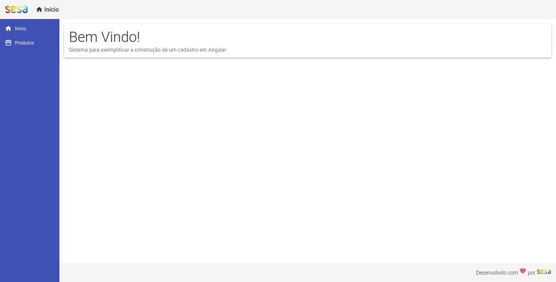
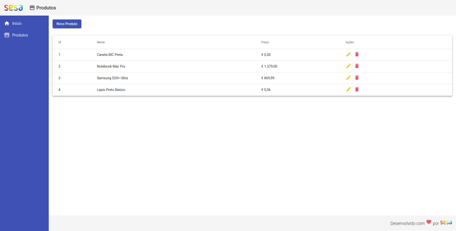
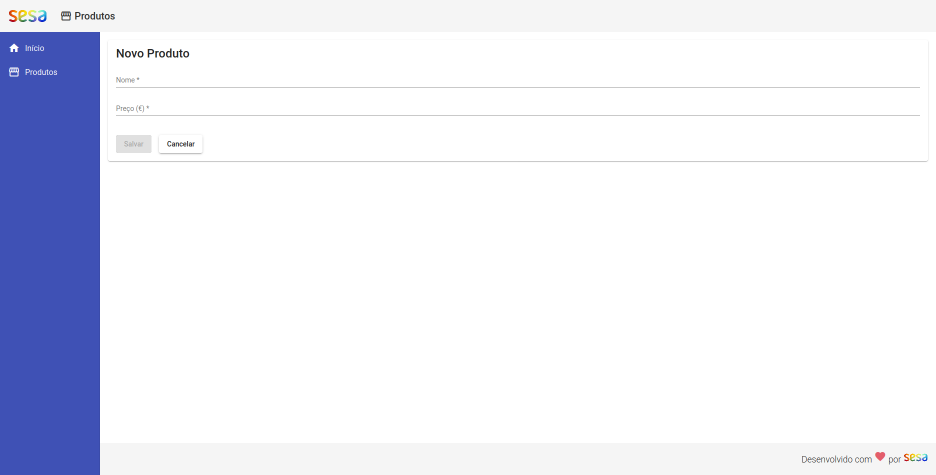
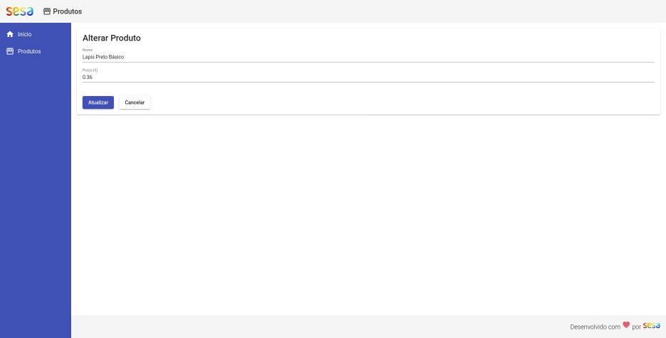
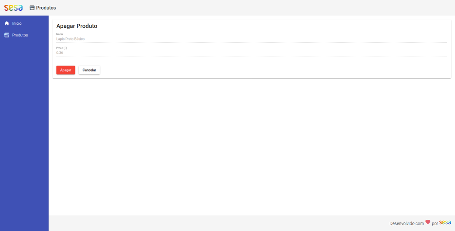

# CRUD-ANGULAR 9

# Table of Contents

- [Requirements](#requirements)
- [Getting started](#getting-started)
  - [Download](#download)
  - [Backend](#backend)
    - [Install](#install)
    - [Run Backend](#run-backend)
  - [Frontend](#frontend)
    - [Install](#frontend)
    - [Run Frontend](#run-frontend)
  - [Images](#images)

# Getting started

The following instructions are guidelines for a download environment, and make the project work.

## Requirements

- [NodeJS](https://nodejs.org/en/download/) 12.18.4 (includes npm 6.14.6)
- [Angular](https://cli.angular.io/) 9

## Download
This is the project in zip file.

- [crud-angular9](https://github.com/slns/crud-angular9/archive/main.zip)

This is the project to clone

- SSH [crud-angular9](git@github.com:slns/crud-angular9.git)
- HTTPS [crud-angular9](https://github.com/slns/crud-angular9.git)

## Backend

### Install

Start with install dependencies\
Go to folder, backend 

```
npm install
```

### Run Backend

```
npm start
```

## Run Frontend

### Install

Start with install dependencies\
Got to Folder, frontend

```
npm install
```

### Run Backend

```
ng serve
```

### Images

Home |
------------ |
 |


List | New
------------ | -------------
 | 


Edit | Delete
------------- | -------------
 | | 